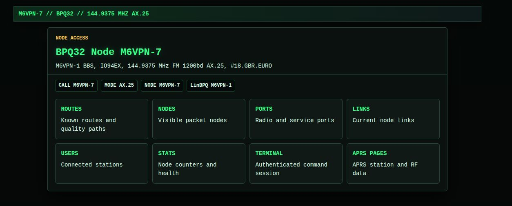
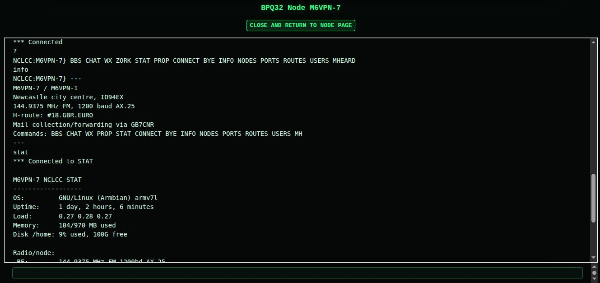
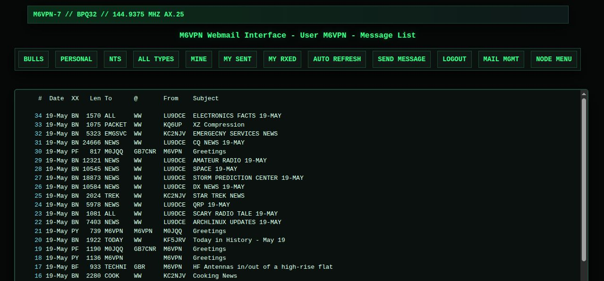

# M6VPN-7

M6VPN-7 is the configuration and support tooling for an AX.25 packet radio node and BBS. The node runs as `M6VPN-7`, and the BBS runs as `M6VPN-1`.

The repo holds Raspberry Pi home-directory files, LinBPQ and Dire Wolf configuration, BPQ BBS door applications, systemd units, LinBPQ web UI templates, and patch tooling for upstream LinBPQ.

## Table of Contents

- [Requirements](#requirements)
- [Directory Structure](#directory-structure)
- [BPQ Applications](#bpq-applications)
- [Install Script](#install-script)
- [LinBPQ Web Design](#linbpq-web-design)
- [LinBPQ Source Patch](#linbpq-source-patch)
- [Compiled Binary HTML Patcher](#compiled-binary-html-patcher)
- [Systemd Units](#systemd-units)
- [Notes](#notes)

## Requirements

- Raspberry Pi 3 or similar ARM Linux host
- Armbian Trixie
- [LinBPQ](https://www.cantab.net/users/john.wiseman/Documents/)
- [Dire Wolf](https://github.com/wb2osz/direwolf)
- Python 3 *(for BPQ helper scripts and patch tooling)*
- Bash
- systemd

###### System Recommendations

- Stable 5V power supply
- Reliable SD card or USB storage
- Backups of `/home/pi/linbpq/bpq32.cfg` before live changes

## Directory Structure

| Path                                  | Purpose                                                    |
|---------------------------------------|------------------------------------------------------------|
| `pi/`                                 | Files intended to live under `/home/pi/` on the node        |
| `pi/bpq-apps/`                        | External BPQ BBS applications and doors                    |
| `pi/bpq-cache/`                       | Cached data used by BPQ applications                       |
| `pi/direwolf.ic2350.conf`             | Dire Wolf TNC configuration                                |
| `pi/linbpq/bpq32.cfg`                 | LinBPQ configuration for M6VPN-7 and M6VPN-1               |
| `pi/linbpq/HTML/`                     | Web BBS templates, shared CSS, JavaScript, and web assets  |
| `images/`                             | Screenshots used by project documentation                  |
| `systemd/`                            | Service, socket, and timer units for the live node         |
| `patches/linbpq-html-design.patch`    | Patch that applies the M6VPN web design to LinBPQ source   |
| `tools/linbpq-html-binary-patcher.py` | Binary patcher for hard-coded LinBPQ web HTML/CSS strings  |
| `3rd/linbpq/`                         | Local upstream LinBPQ checkout *(ignored by this repo)*    |

## BPQ Applications

External BPQ applications are configured through `CMDPORT` and `APPLICATION` entries in `pi/linbpq/bpq32.cfg`.

```
CMDPORT 63030 63031 63032 63033 63034
```

| Application | Callsign | Command | Host Port |
|-------------|----------|---------|-----------|
| BBS         | M6VPN-1  | BBS     | Internal  |
| CHAT        | M6VPN-4  | CHAT    | Internal  |
| WX          |          | WX      | HOST 0    |
| ZORK        |          | ZORK    | HOST 1    |
| STAT        |          | STAT    | HOST 2    |
| PROP        |          | PROP    | HOST 3    |
| HELP        |          | HELP    | HOST 4    |

Relevant config lines:

```
APPLICATION 1,BBS,,M6VPN-1,VPNBBS,255
APPLICATION 2,CHAT,,M6VPN-4,NCLCHT,25
APPLICATION 3,WX,C 10 HOST 0 S
APPLICATION 4,ZORK,C 10 HOST 1 S
APPLICATION 5,STAT,C 10 HOST 2 S
APPLICATION 6,PROP,C 10 HOST 3 S
APPLICATION 7,HELP,C 10 HOST 4 S
```

## Install Script

`install.sh` updates the live Raspberry Pi layout from this repo. Run it as root on the live system.

```
./install.sh menu
```

| Command            | Action                                                                  |
|--------------------|-------------------------------------------------------------------------|
| `menu`             | Interactive menu                                                        |
| `pi`               | Copy `./pi/` to `/home/pi/`                                             |
| `pi yes`           | Copy `./pi/` except `bpq32.cfg`, then patch the live `bpq32.cfg`        |
| `pi-patch`         | Same as `pi yes`                                                        |
| `systemd-update`   | Copy `systemd/*` to `/etc/systemd/system/` and reload systemd           |
| `systemd-install`  | Update systemd units, then enable sockets, timers, and core services    |

The `pi` copy includes `pi/linbpq/HTML/`, so web templates, CSS, JavaScript, images, and icons are updated on the live node.

## LinBPQ Web Design

The M6VPN web design lives in `pi/linbpq/HTML/`.

| File                  | Purpose                                                         |
|-----------------------|-----------------------------------------------------------------|
| `index.html`          | Main node entry page when APRS pages are available              |
| `indexnoaprs.html`    | Main node entry page without APRS navigation                    |
| `NodeMenu.html`       | Styled node control menu                                        |
| `m6vpn.css`           | Shared UNIX-style packet radio design                           |
| `m6vpn-ui.js`         | Small helper script for legacy LinBPQ tables and page classes   |
| `webscript.js`        | LinBPQ WebMail script with M6VPN CSS and JS bootstrapping       |
| `*.txt`               | LinBPQ BBS, WebMail, chat, forwarding, and config templates     |
| `background.jpg`      | Background image asset                                          |
| `favicon.ico`         | Browser icon                                                    |

Recent LinBPQ builds only use a few template files for the first page layout, and keep much of the web BBS interface hard-coded in C. The CSS and JavaScript files are still useful because LinBPQ can serve files from the `HTML` directory directly.

## LinBPQ Source Patch

[patches/linbpq-html-design.patch](patches/linbpq-html-design.patch) applies the M6VPN web design to an upstream LinBPQ source checkout. It adds the complete `pi/linbpq/HTML/` design set and patches LinBPQ C source files that emit hard-coded HTML so they load `/m6vpn.css` and `/m6vpn-ui.js`.

This is useful when maintaining a fork of LinBPQ or when rebuilding LinBPQ with the M6VPN web design included in the source tree. The source changes cover BBS, WebMail, chat, APRS, node pages, and modem/status pages that render HTML directly from C strings.

### Screenshots







Apply it from the root of this repo:

```
cd 3rd/linbpq
git apply --check ../../patches/linbpq-html-design.patch
git apply ../../patches/linbpq-html-design.patch
```

Verify the result:

```
diff -qr ../../pi/linbpq/HTML HTML
git status --short
```

Reverse it from `3rd/linbpq`:

```
git apply --reverse ../../patches/linbpq-html-design.patch
```

The patch includes binary assets and source edits, so keep it as a Git binary patch. Do not regenerate it with plain `diff -u`, because that will not preserve `background.jpg` or `favicon.ico`.

Regenerate the patch after changing `pi/linbpq/HTML/`:

```
mkdir -p 3rd/linbpq/HTML
cp -a pi/linbpq/HTML/. 3rd/linbpq/HTML/
git -C 3rd/linbpq add -N HTML
git -C 3rd/linbpq diff --binary -- HTML > patches/linbpq-html-design.patch
```

If source files in `3rd/linbpq/` are also changed, append their diff to the same patch:

```
git -C 3rd/linbpq diff --binary -- '*.c' >> patches/linbpq-html-design.patch
```

## Compiled Binary HTML Patcher

`tools/linbpq-html-binary-patcher.py` patches hard-coded LinBPQ HTML and CSS strings inside a compiled binary. It is for cases where templates and static files are not enough because the page markup is compiled into LinBPQ itself.

The patcher only performs equal-length byte replacements. That preserves binary offsets and avoids rewriting executable structure.

Dry-run a binary first:

```
tools/linbpq-html-binary-patcher.py --dry-run /path/to/linbpq
```

Write a patched copy:

```
tools/linbpq-html-binary-patcher.py /path/to/linbpq --output /path/to/linbpq-m6vpn
```

Patch in place with the default timestamped backup:

```
tools/linbpq-html-binary-patcher.py /path/to/linbpq
```

The binary patcher handles legacy hard-coded pages such as node signon, mail signon, WebMail tables, and old white or cream backgrounds. It also includes upgrade rules for binaries patched by earlier versions of this tool.

## Systemd Units

The systemd units connect LinBPQ `CMDPORT` sockets to local helper applications and manage the core node services.

| Unit                        | Purpose                                      |
|-----------------------------|----------------------------------------------|
| `bpq-wx.socket`             | WX BPQ application socket                     |
| `bpq-wx@.service`           | WX command service                            |
| `bpq-zork.socket`           | ZORK BPQ application socket                   |
| `bpq-zork@.service`         | ZORK command service                          |
| `bpq-stat.socket`           | STAT BPQ application socket                   |
| `bpq-stat@.service`         | STAT command service                          |
| `bpq-prop.socket`           | PROP BPQ application socket                   |
| `bpq-prop@.service`         | PROP command service                          |
| `bpq-help.socket`           | HELP BPQ application socket                   |
| `bpq-help@.service`         | HELP command service                          |
| `direwolf-ic2350.service`   | Dire Wolf service for the IC-2350 setup       |
| `linbpq.service`            | LinBPQ node service                           |
| `prop-cache-update.service` | NOAA/SWPC propagation cache update service    |
| `prop-cache-update.timer`   | Scheduled propagation cache updates           |

## Notes

- `3rd/` is ignored by this repo. Keep upstream LinBPQ source or forks there locally.
- `.gitmodules` is ignored here because third-party source is handled manually.
- Run live install commands as root on the node.
- Do not overwrite a working live `bpq32.cfg` unless that is intended. Use `pi-patch` when preserving and patching the live config is safer.
